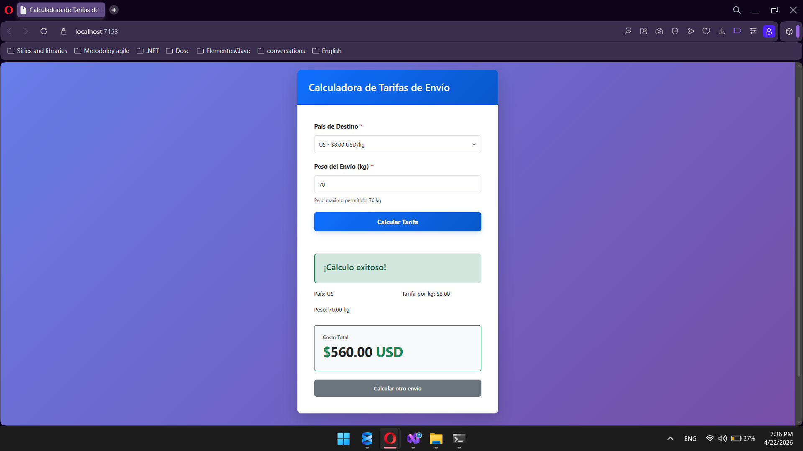

# 🌍 International Shipping Rate Calculator


> **Solución integral para la automatización logística.** Este sistema permite a las empresas de comercio electrónico calcular tarifas de envío internacionales de forma precisa, resiliente y escalable[cite: 135].

---

## 📖 Tabla de Contenidos
* [Planteamiento del Problema](#-planteamiento-del-problema)
* [Beneficios de la Solución](#-beneficios-de-la-solución)
* [Reglas de Negocio](#-reglas-de-negocio)
* [Arquitectura del Sistema](#-arquitectura-del-sistema)
* [Flujo de Funcionamiento](#-flujo-de-funcionamiento)
* [Instalación y Ejecución](#-instalación-y-ejecución)

---

## 🎯 Planteamiento del Problema
Actualmente, muchas empresas de comercio electrónico carecen de un medio automatizado para procesar tarifas de envío. El cálculo manual presenta las siguientes deficiencias:
* **Inconsistencia:** Variación en montos cobrados por errores humanos.
* **Baja Eficiencia:** Dificultad para obtener el monto de envío de forma inmediata para el cliente.
* **Falta de Escalabilidad:** Problemas para integrar nuevos destinos o modificar tarifas rápidamente.

---

## 🚀 Beneficios de la Solución
Al implementar este módulo, la compañía obtiene ventajas competitivas estratégicas[cite: 141]:

| Beneficio | Impacto | Descripción |
| :--- | :---: | :--- |
| **Automatización** | ⚡ | Cálculo instantáneo del costo de envío sin intervención manual. |
| **Experiencia de Usuario** | 😊 | El cliente visualiza si cuenta con el factor monetario antes de la compra. |
| **Eficiencia Operativa** | 📉 | Reducción significativa del tiempo necesario para procesar pedidos. |
| **Mantenibilidad** | 🛠️ | Arquitectura que permite modificar montos o agregar países fácilmente. |

---

## 🧠 Reglas de Negocio
El sistema utiliza un motor de reglas basado en el país de destino seleccionado. La fórmula general es:  
`Tarifa = Peso del Paquete × Factor de Región`.

| País | Factor de Costo | Principio Aplicado |
| :--- | :--- | :--- |
| **🇮🇳 India** | 5 USD | Open/Closed Principle |
| **🇺🇸 Estados Unidos** | 8 USD | Open/Closed Principle |
| **🇬🇧 Reino Unido** | 10 USD | Open/Closed Principle |

---

## 🏗 Arquitectura del Sistema
Diseñado bajo el patrón de **Arquitectura en Capas** y **DDD**, garantizando que el equipo de desarrollo pueda comprender y escalar cada componente.

### 📂 Capas del Proyecto
1. **Presentación (Web UI):** Desarrollada en Razor Pages. Contiene el formulario de captura y validación de inputs.
2. **Aplicación (Business Logic):** Orquestación mediante el `TariffService` para procesar la solicitud del cliente.
3. **Dominio:** Núcleo del sistema. Contiene las entidades (`Shipment`, `Country`) y la lógica pura de cálculo (`TariffCalculator`).
4. **Infraestructura:** Manejo de persistencia con **SQL Server** y el patrón Repository (`CountryRepository`).

---

## 🔄 Flujo de Funcionamiento
De acuerdo al **Diagrama de Diseño de la Solución**[cite: 181]:

1. **Entrada:** El usuario accede al portal e ingresa peso y destino.
2. **Procesamiento:** El sistema valida los datos y aplica la regla correspondiente (`x5`, `x8` o `x10`).
3. **Salida:** Se genera el resultado y se visualiza el costo final para el usuario.

---

## 📸 Evidencias del Sistema

### 🖥️ Interfaz de Usuario

*Formulario amigable para la captura de datos (Peso y Destino).*

### 💰 Resultado del Cálculo

*Visualización clara del costo final calculado automáticamente.*

---

## ⚙️ Instalación y Ejecución

### 🔧 Requisitos Previos
* .NET 6 o superior.
* SQL Server / LocalDB.
* Visual Studio 2022 o VS Code.

### 📥 Pasos para Ejecutar
1. **Clonar Repositorio:**
   ```bash
   git clone [https://github.com/tu-usuario/InternationalShippingRateCalculator.git](https://github.com/tu-usuario/InternationalShippingRateCalculator.git)

2. **Configurar Base de Datos:**
    ```bash
    Ejecutar el script ubicado en /database/script.sql para crear las tablas y cargar las tarifas iniciales.

3. **Conexión:**
   ```bash
   Asegúrate de que el appsettings.json apunte a tu servidor local:
   "DefaultConnection": "Server=(localdb)\\MSSQLLocalDB;Database=ShippingDB;Trusted_Connection=True;"
   
4. Run
-  ```bash
   d0otnet run

- > [!NOTE]
Este proyecto es de uso académico desarrollado por `Joel Alberto Benitez Varela` pertenenciente al `Instituto Tecnonologico de las Americas`.
