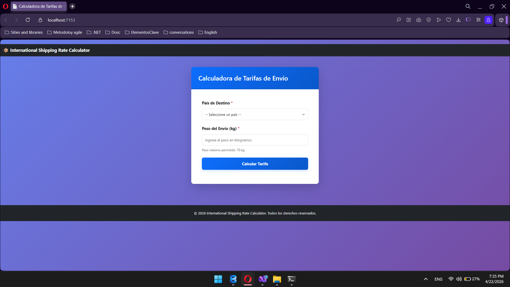
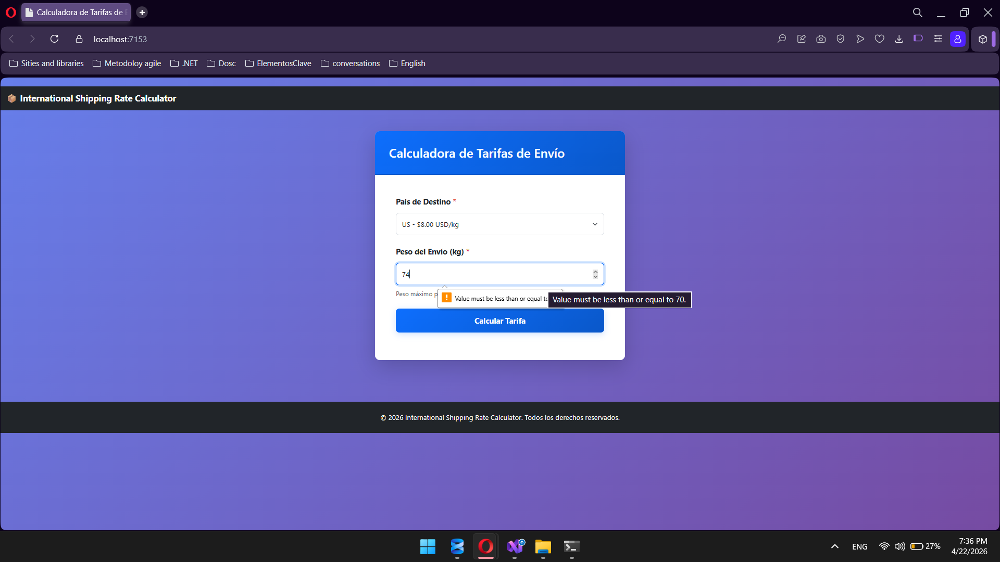

# 🌍 International Shipping Rate Calculator

> Sistema para el cálculo automatizado de tarifas de envío internacional, diseñado bajo principios de **Clean Architecture** y **Domain-Driven Design (DDD)**.

---

## 🚀 Descripción General

Este sistema permite a los usuarios calcular el costo de envío internacional de un paquete ingresando:

- 📦 Peso del paquete  
- 🌎 País de destino  

El sistema procesa estos datos y devuelve el costo basado en reglas de negocio definidas.

---

## 🎯 Problema que Resuelve

El cálculo manual de envíos internacionales suele ser:

- Propenso a errores ❌  
- Poco escalable ❌  
- Inconsistente ❌  

### ✔ Solución

- Automatización del cálculo  
- Reglas centralizadas  
- Escalabilidad para nuevos países  

---

## 🧠 Reglas de Negocio

| País | Fórmula |
|------|--------|
| 🇮🇳 India | Peso × 5 USD |
| 🇺🇸 Estados Unidos | Peso × 8 USD |
| 🇬🇧 Reino Unido | Peso × 10 USD |

✔ Implementadas bajo el principio **Open/Closed**  
✔ Extensibles sin modificar código existente  

---

## 🏗 Arquitectura del Sistema

El sistema sigue una arquitectura en capas:

### 🖥️ Presentación
- Razor Pages
- Formulario de entrada
- Visualización de resultados

### ⚙️ Aplicación
- `TariffService`
- Orquestación del flujo

### 🧩 Dominio
- Entidades (`Shipment`, `Country`)
- Reglas (`ITariffRule`)
- Cálculo (`TariffCalculator`)

### 🗄️ Infraestructura
- `CountryRepository`
- SQL Server

---

## 🔄 Flujo del Sistema

---
## 📸 Evidencias del Sistema

Las siguientes capturas validan el funcionamiento del sistema y se encuentran en:

---

### 🖥️ Interfaz Inicial del Sistema

📌 Permite al usuario ingresar el peso del paquete y seleccionar el país de destino.

---

### 📊 Reglas de Negocio

📌 Representa cómo el sistema aplica las tarifas según el país seleccionado.

---

### 💰 Resultado del Cálculo

📌 Muestra el costo final calculado en base a los datos ingresados.

---

## 🗄️ Base de Datos

El sistema utiliza SQL Server para la persistencia de datos.

### 📁 Ubicación

### 📌 Contenido del Script

- Creación de la base de datos  
- Tabla de países  
- Tarifas por país  

---

## ⚙️ Instalación y Ejecución

### 🔧 Requisitos

- .NET 6 o superior  
- SQL Server / LocalDB  
- Visual Studio / VS Code  

---

### 📥 Pasos

#### 1. Clonar el repositorio

#### Configurar la Base de Datos

Ejecutar el script:
/database/script.sql

#### Configurar conexión

Editar appsettings.json:
"ConnectionStrings": {
  "DefaultConnection": "Server=(localdb)\\MSSQLLocalDB;Database=InternationalShippingRateCalculator;Trusted_Connection=True;"
}

#### Ejecutar el proyecto
dotnet run

